## Concept proiect

> Conceptul proiectului este de a prelua un semnal de la un instrument(un semnal analogic) si de a aplica un efect(modifica semnalul) prin intermediul unui microntroller si de a reda la iesire semnalul modificat.
>
> Texas Instruments a prezentat aceasta idee in 2006 in aceasta schema bloc:

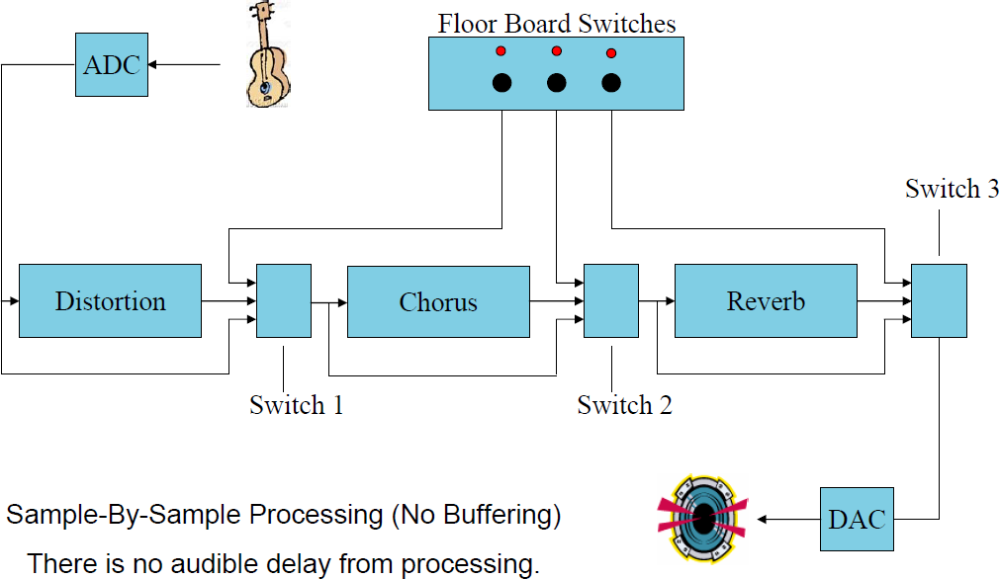

> Fig 1.1.1.Schema bloc generala interfetei audio In aceasta diagrama,principiul de functionare este urmatorul:
>
> Este preluat semnalul de la chitara prin intermediul unui ADC , dupa care semnalul achizitionat este transmis prin protocolul I2S catre STM32(interfata DSP) .Al doilea pas este ca MCU sa modifice semnalul prin aplicarea unor algoritmi matematici care modifica semnalul,dupa care acesta este transmis la iesire.
>
> In acest sistem,se pot combina algoritmii pentru a obtine efecte diferite la iesire.

## Descrierea sistemului

> S-au stabilit urmatoarele sisteme pentru implementarea algoritmilor de tip DSP:
>
> 
>
> Fig 1.2.1.Efect de tip delay realizat in MATLAB Simulink folosind DSP System Toolbox

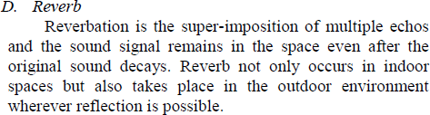

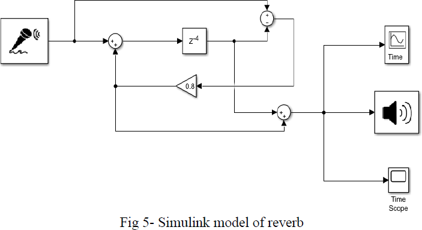

> Fig 1.2.2.Efect de tip reverb realizat in MATLAB Simulink folosind DSP System Toolbox
>
> 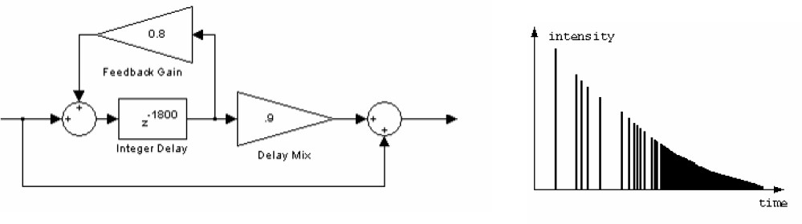
>
> Fig 1.2.2.Efect de tip reverb simplificat realizat in MATLAB Simulink folosind DSP System Toolbox

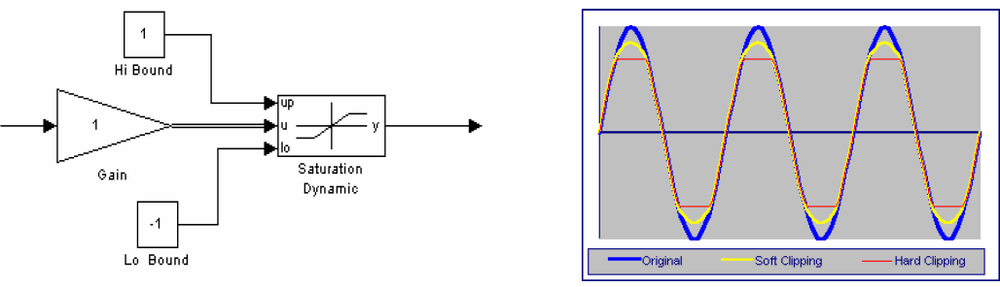

> Fig 1.2.3.Efect de tip distortion realizat in MATLAB Simulink folosind DSP System Toolbox

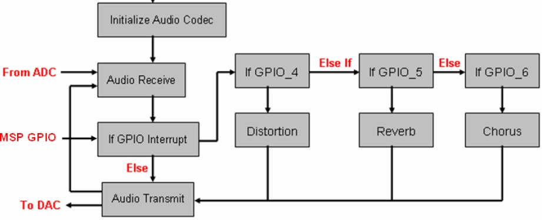

> Fig 1.2.4.Schema bloc generala a fluxului de lucru afirmware-ului pentru STM32

# Implementarea aplicației Hardware

## Specificatii tehnice

> Am propus pentru acest proiect sa folosesc urmatoarele module:

- PCM5102 Digital to Analog Converter – AUDIO OUT STEREO

- PCM1808 Analog to Digital Converter – AUDIO IN STEREO

- Nucleo G431 STM32 – DSP

> 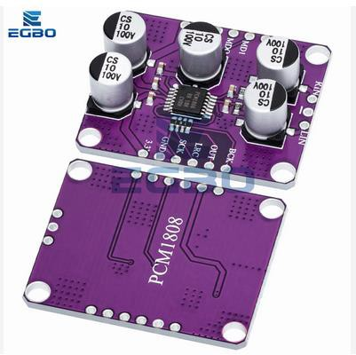Modulele PCM folosesc protocolul I2S,care este special folosit in aplicatii audio.Acestea sunt de tip format Left-justified si sunt pe 24 bit care trimit pachete a cate 32 biti(Half-Word).
>
> \`

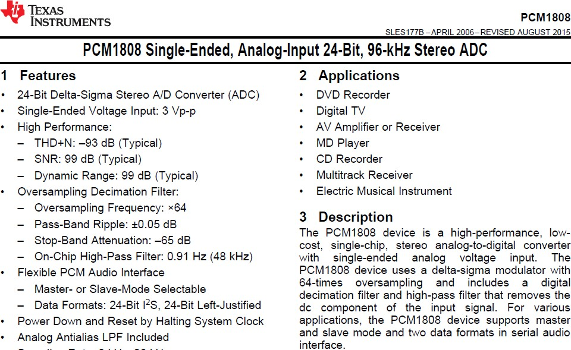

> Fig 2.1.1..Specificatii generale PCM1808 ADC
>
> 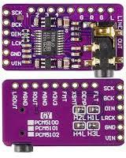

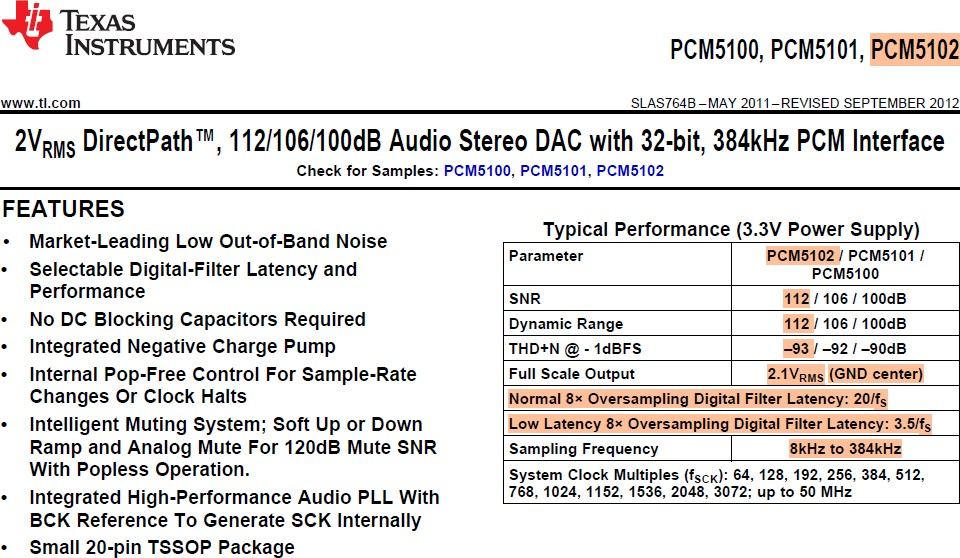

> Fig 2.1.2..Specificatii generale PCM5102 DAC
>
> Circuitul integrat suporta pana la 384 kHz Sample Rate,dar suntem limitati de ADC deoarece acesta suporta doar pana la 98Khz.
>
> 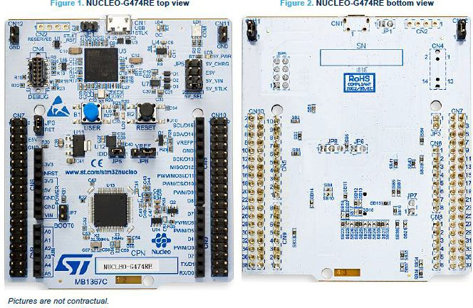
>
> Fig 2.1.3.Placa de dezvoltare Nucleo G431 STMicroelecronics

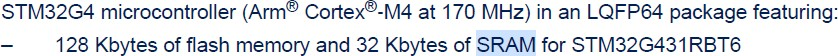

> Deoarece RAM-ul de pe placa STM32 este limitat ,folosirea unei librarii de tip DSP este solicitanta pentru MCU,deci se vor folosi librarii care folosesc algoritmi simpli.
>
> Selectarea formatului se va face hardware inainte sa implementam programul in CubeMX:

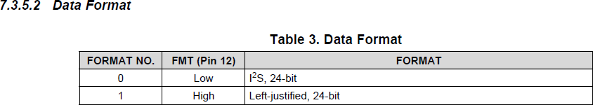

> Fig 2.1.4.Data Format selection for PCM1808A(ADC)
>
> Formatul pentru modulul PCM5102(DAC) este implicit Left-justified deci vom lega pin-ul FMT(pin 12) al ADC-ului la GND.

## Periferice utilizate MCU & PCM

> In STM32CUBEMX s-a realizat urmatoarele configurari pentru comunicatia I2S:
>
> 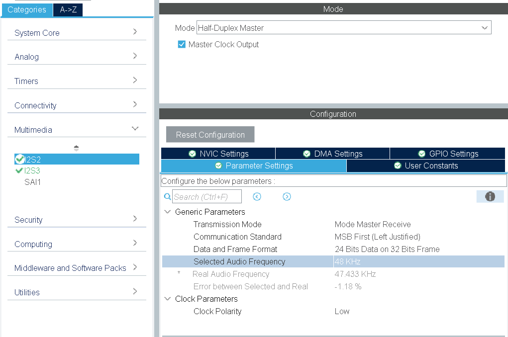
>
> Fig 2.2.1..Configuratia I2S in STM32CUBEMX
>
> Am stabilit I2S2 ca fiind ADC-ul(PCM1808A) care va trimite sample-urile catre STM32 si I2S3 DAC(PCM5102) care va trimite semnalul modificat la iesire.
>
> Modul de transmisie va fii Mode Master Receive pentru ADC si Mode Master Transmit pentru DAC. Nefiind module slave,se va selecta modul Half-Duplex Master pentru I2Sx pentru ambele module.
>
> Modulul ADC va avea nevoie de un clock extern,deci vom selecta optiunea Master Clock Output.
>
> Modulul DAC nu va avea nevoie de un clock extern,deoarece isi genereaza clock-ul intern prin intermediul unei bucle PLL.
>
> Pentru I2Sx s-au folosit DMA de tip circular.
>
> Vom seta prioritatea pe Very High deoarece vrem sa avem un timing cat mai bun al transmisiei/receptiei de date.
>
> 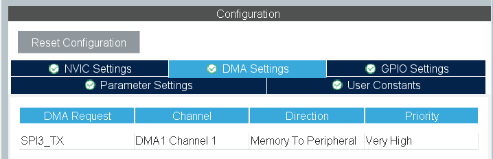

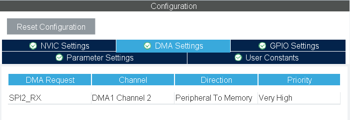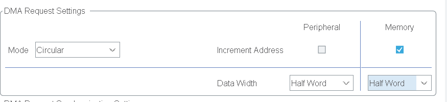

> Deoarece se trimit datele in pachete de 32 biti,vom folosi Data Width pe Half Word.
>
> Pentru configurarea si functionarea stabila a MCU-ului se vor configura RCC/SYS si Clock:

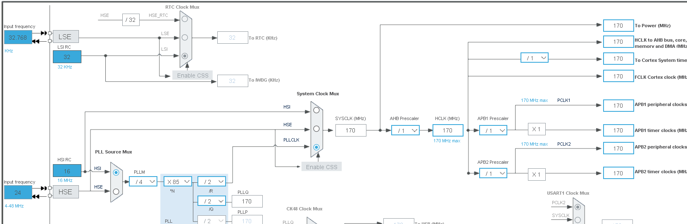

> 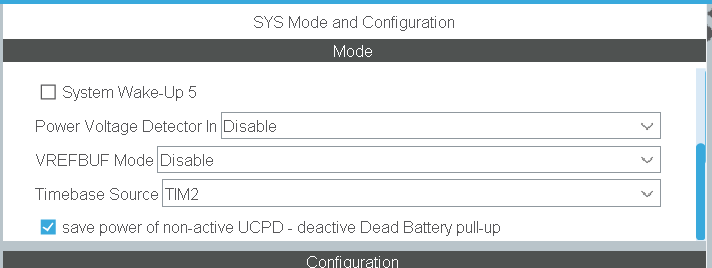

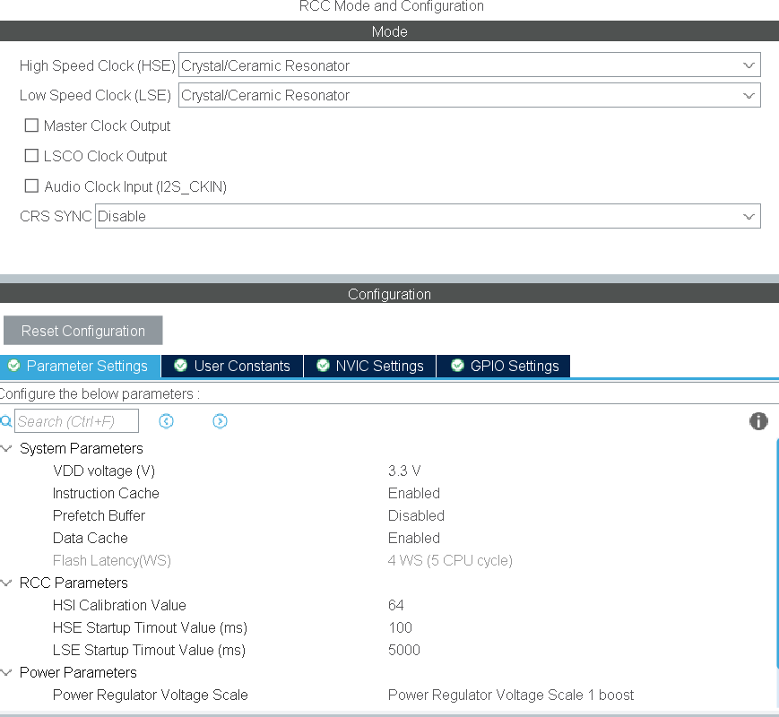

> Pentru schimbarea efectelor prin comunicatia UART/USART vom activa optiunea din MX:
>
> 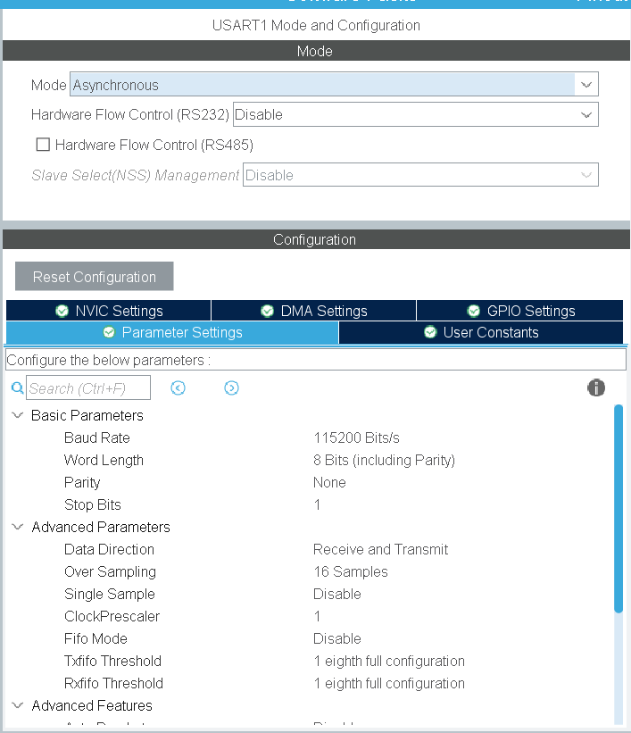
>
> In final avand urmatoarea configuratie de cablaj:
>
> 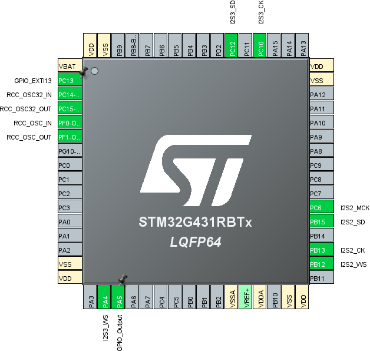
>
> Folosind diagrama de pinnout putem realiza conexiunile aferente comunicatiei I2S:
>
> 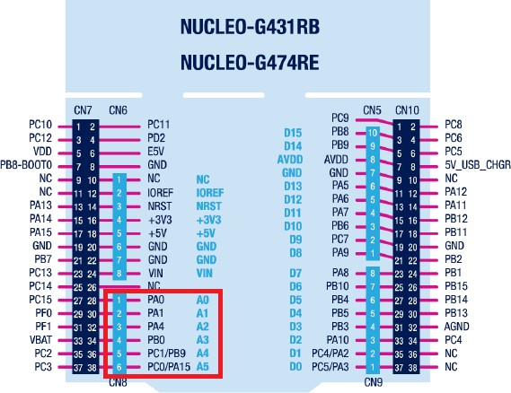

## 2.1.3.Configurarea modulelor PCM5102 & PCM1808A folosind protocolul I2S in STM32CUBEMX

# Implementare Firmware

## Filtru Digital

> Pentru nu a permite zgomotului din zona 0-90 Hz sa interfereze cu semnalul achizitionat,vom aplica un filtru digital cand procesam semnalul preluat de la ADC.Experimental,vom putea vedea faptul ca taierea se face la 90-110 Hz,dar nu garanteaza o calitate mai buna a semnalului,fiind o solutie temporara.
>
> In fisierul dsp_filters.c se gasesc si alte filtrele aplicate in firmware.
>
> 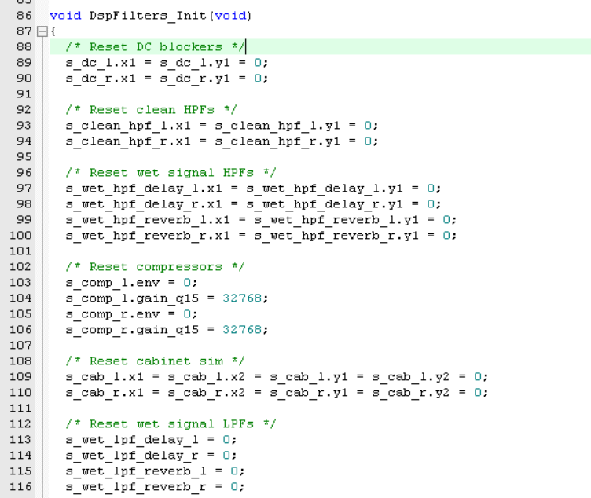
>
> Fig 3.1.1.Functie pentru aplicare filtru digital High Pass si a altor filtre

## Efecte digitale ( Distortion,Reverb,Delay)

> Pentru efectele digitale aplicate pentru semnale,putem prelua sistemele validate in simulink si sa transpunem sistemul in cod.Pentru aceasta procedura,se va folosi
>
> In fisierul dsp_distortion.c s-a creat functia DspDistortion_Process care preia semnalul achizitionat si aplica un gain foarte mare al semnalului stabilind o limita de saturatie,in care sa taie semnalul si sa nu provoace oscilatii din cauza gain-ului maxim.Se considera ideal un gain infinit si o tensiune de prag pe amplitudinea semnalului:
>
> In aceasta aplicatie se va folosi o librarie externa. Parametrul global pentru distrtion este ,,Drive,, .
>
> 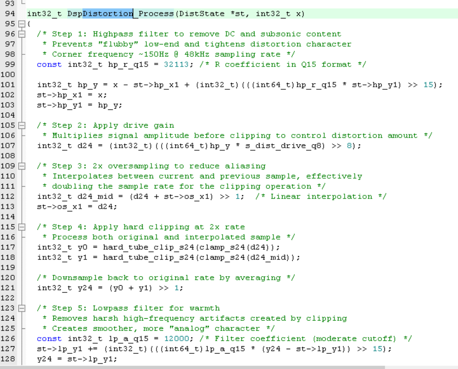
>
> Fig 3.1.2.Functie pentru aplicarea de efect distortion pe semnalul achizitonat
>
> Pentru efectul de reverb ,putem urma diagramele simulink parametrii folositi si putem implementa algortimul dupa sistemul propus.Parametrii folositi in functie sunt feedback,mix si decay.
>
> 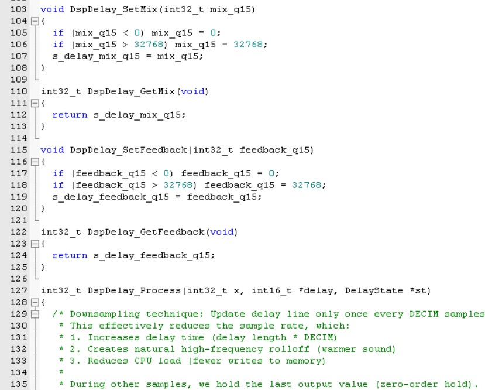
>
> Fig 3.1.3.Functie pentru aplicarea de efect reverb pe semnalul achizitionat
>
> Pentru delay,putem urma sistemul propus si implementa efectul de delay(preluat din librarie).Parametrii globali sunt Phase si Mix.
>
> 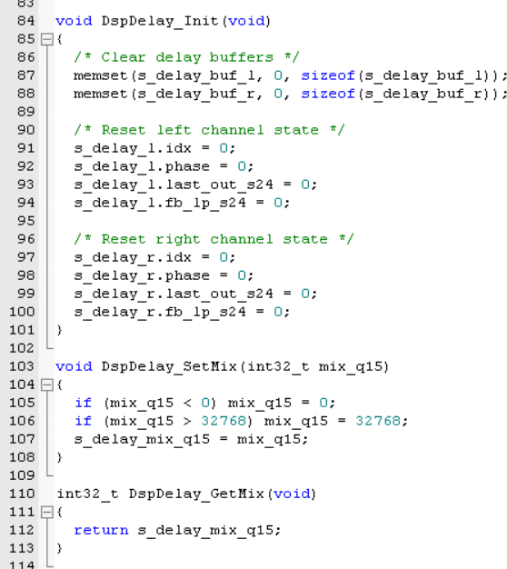
>
> Fig 3.1.3.Functie pentru aplicarea de efect delay pe semnalul achizitionat

## Interfata UI pentru manipularea efectelor digitale prin intermediul comunicatiei UART/USART

> Pentru schimbarea efectelor s-a realizat o aplicatie in Flutter pentru a valida ca efectele se aplica folosind comunicatia UART prin USB pentru a face broadcast la comenzi.
>
> Fluxul de lucru este urmatorul:Utilizatorul selecteaza comunicatia port(COMx) la care vrea sa conecteze placa de dezvoltare cu firmware-ul incarcat.Se conecteaza la microcontroller si daca conexiunea este valida(PING),placa de dezvoltare va trimite un mesaj de validare PONG la un interval de 5 secunde.
>
> ... ,

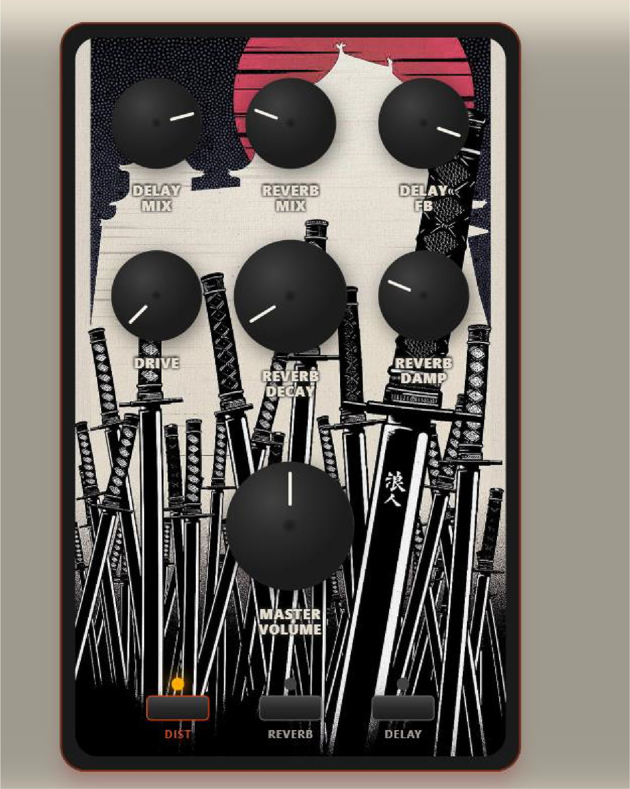

> 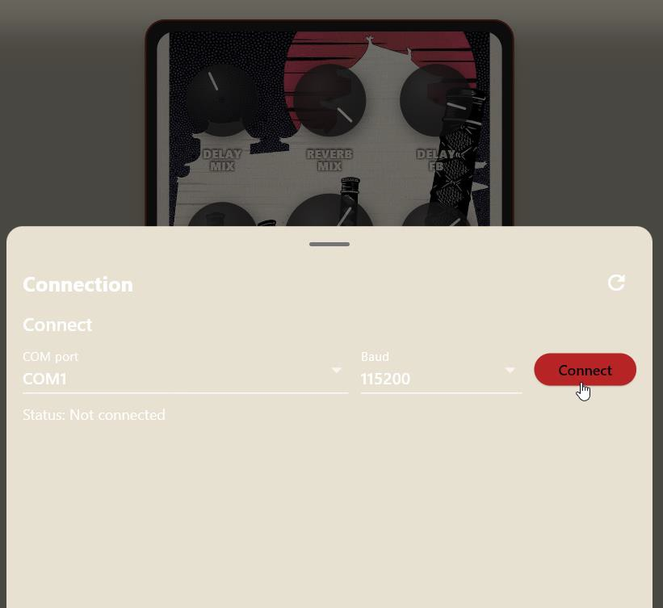
>
> Schimbarea efectelor este live ,utilizatorul folosind-use de reglajele(knob-urile) de pe interfata grafica a pedalei:
>
> 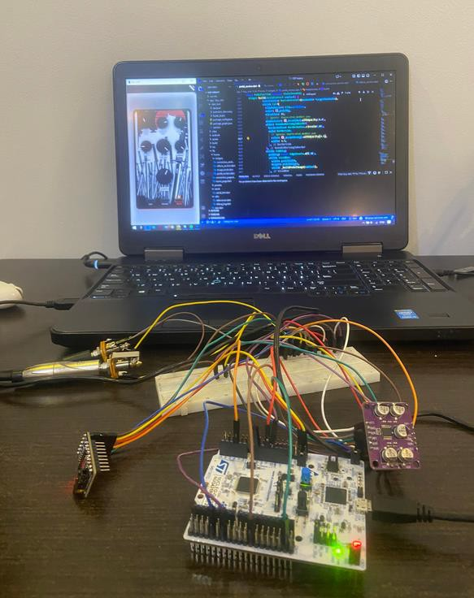
>
> Semnalelul de intrare este aplicat pe ambele canale L/R.(modulele sunt STEREO) Exemplu de comanda trimisa prin intermediul UART(COM) de la PC la MCU:
>
> 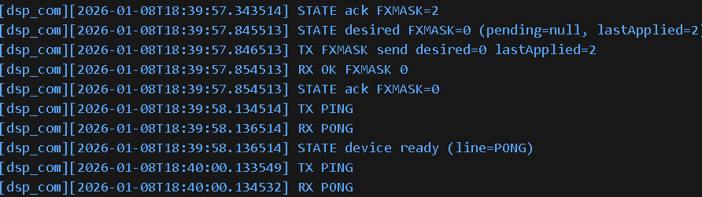
>
> 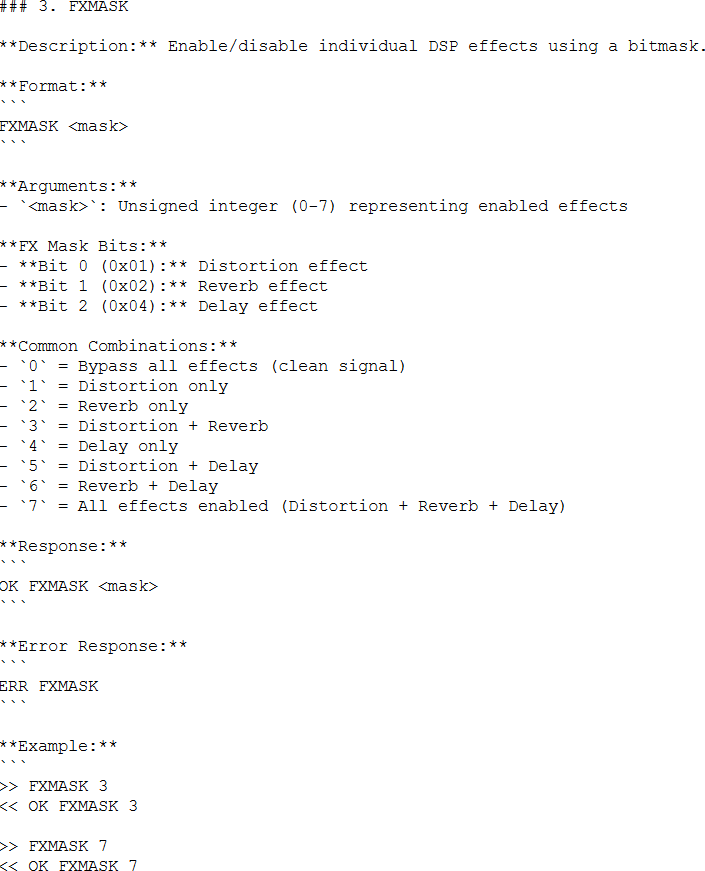

# Interpretarea masuratorilor

> Pentru a valida masuratorile si functionarea comunicatiei I2S s-au masurat semnalele de clock si date daca respecta urmatoarea tabela:

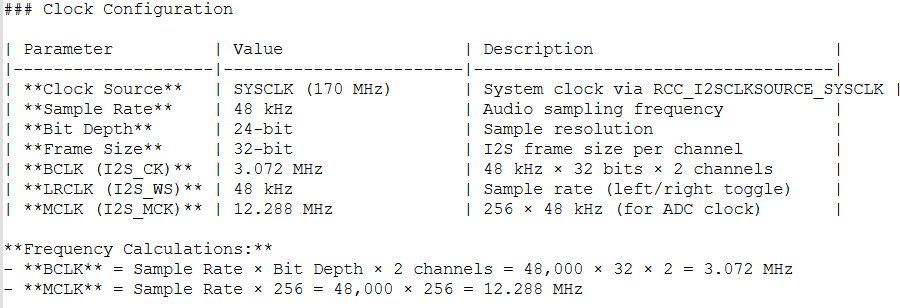

> Fig 4.1.1.Tabela frecventelor ideale pentru comunicatia I2S Left-justified

## Semnalele BCLK,LRCK,SDIN/SDOUT si MCLK

> In aceasta masuratoare s-a folosit un osciloscop SIGLENT SDS1204 si un generator de semnal UNI TREND UGT1022X.Se poate vedea in imagine parametrii setati pentru generatorul de semnal pentru semnalul de intrare catre ADC.

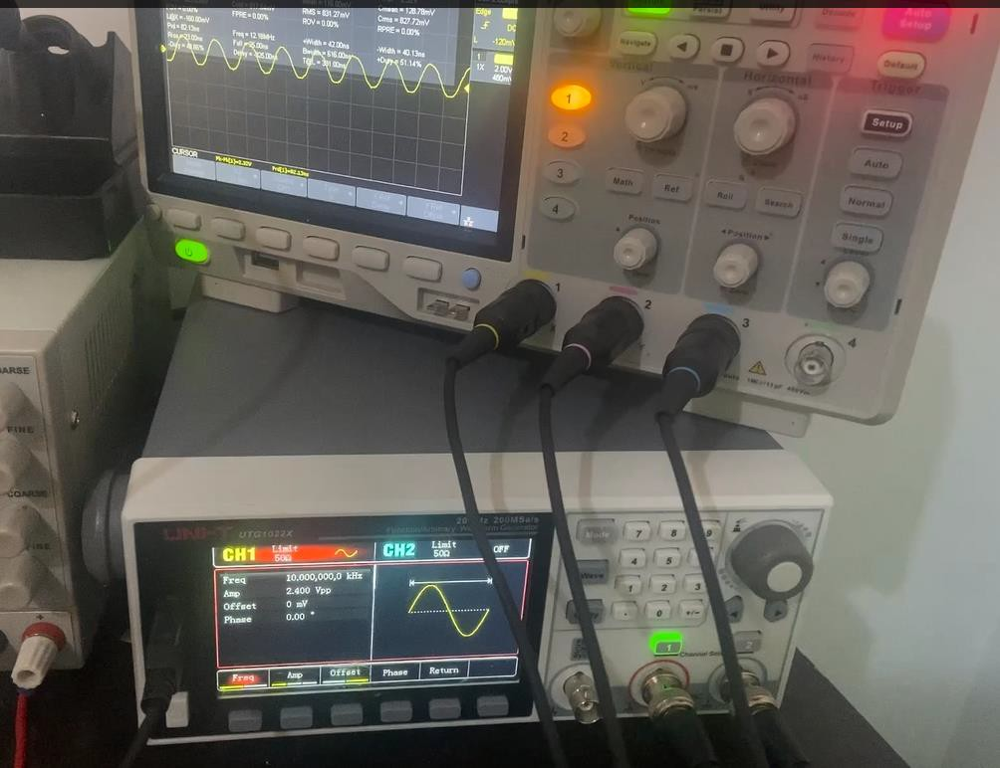

> Fig 4.1.1.Setup aparate de masura osciloscop+generator de semnal Pentru BCLK am obtinut astfel:
>
> 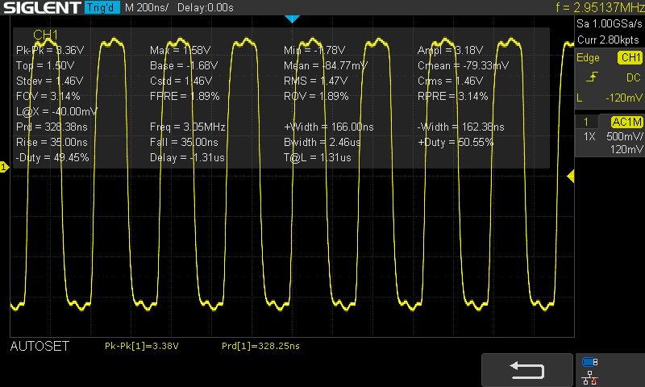
>
> Fig 4.1.2.Semnalul BCLK pentru ADC si DAC
>
> Deoarece sunt folosite fire dupont in aceasta aplicatie si o placa breadboard,se formeaza foarte multe antene si vom avea probleme de EMI.Semnalul este stabil,avand o masuratoare de 2.95-3.05Mhz.
>
> Pentru semnalul SCK la ADC am obtinut:

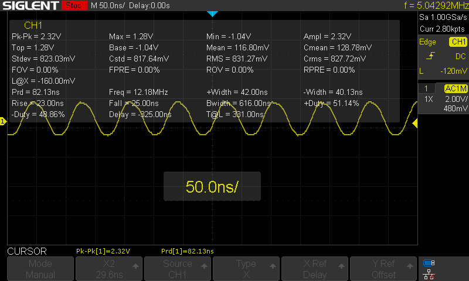

> Fig 4.1.4.Semnalul SCK ADC
>
> Semnalul masurat este de 5.04Mhz care este auto-generat din placa de dezvoltare pentru referinta de clock a ADC-ului.(I2S_CKIN)
>
> 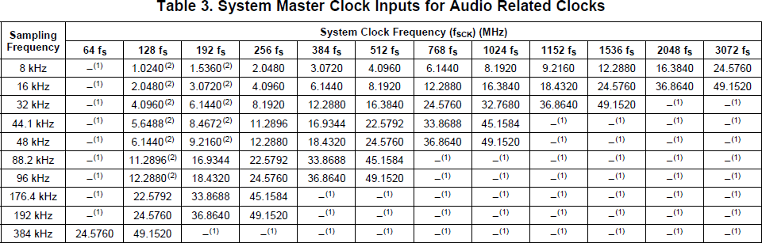DAC-ul nu are nevoie de semnal de SCK deoarece isi genereaza clock-ul intern printr-o bucla PLL.In documentatie se recomanda utilizarea buclei PLL deoarece reduce emisiile EMI. Daca exista o referinta de clock mai precisa,urmatorul tabel este propus pentru aceasta aplicatie:
>
> Fig 4.1.5.Tabela cu frecvente de clock pentru DAC Pentru LRCK(I2S_WS) am obtinut pentru ambele module:
>
> 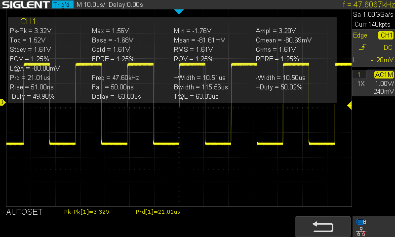
>
> Fig 4.1.6.Semnalul LRCK pentru ADC/DAC
>
> Dupa validarea functionarii clock-urilor,am aplicat un semnal sinusoidal cu frecventa de 1kHz de la un generator de semnal si am masurat urmatorii parametrii ale semnalelor de IN-OUT:
>
> 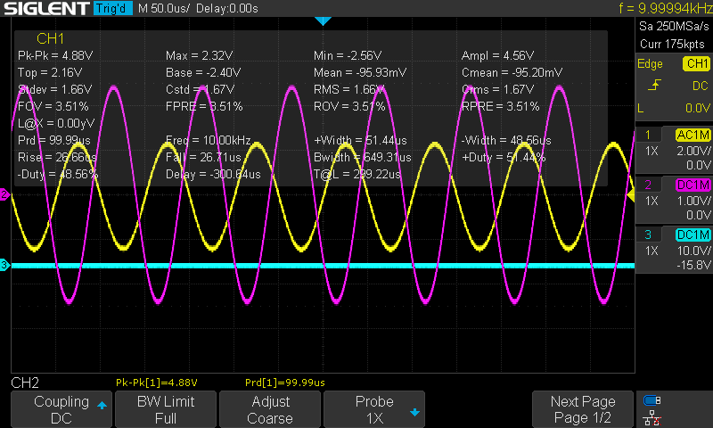
>
> Fig 4.1.7.Parametrii semnalelor de intrare(ADC) – iesire (DAC) pe o fs=48Khz
>
> Unde semnalul mov(CH2) reprezinta semnalul de intrare catre ADC de la generatorul de semnal si semnalul galben(CH1) semnalul de iesire din DAC.
>
> In cazul acesta avem o frecventa de sampling de 48kHz.
>
> A doua masuratoare a fost cu o frecventa de sampling de 8kHz:

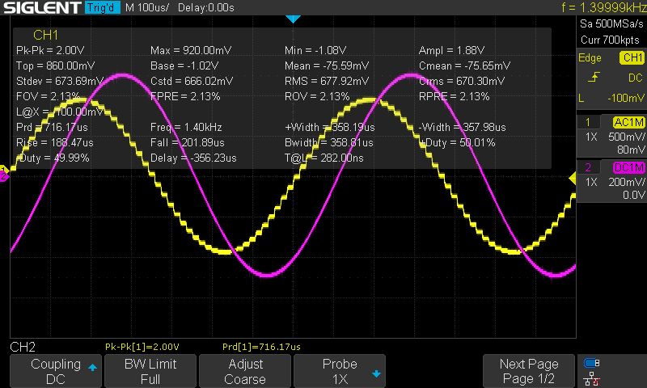

> Fig 4.1.8.Parametrii semnalelor de intrare(ADC) – iesire (DAC) pe o fs=8Khz
>
> Daca pragul fs este depasit,semnalul se va atenua si va tinde spre zero. Am masurat defazajul semnalelor IN-OUT cu metoda lui Lissajous:
>
> 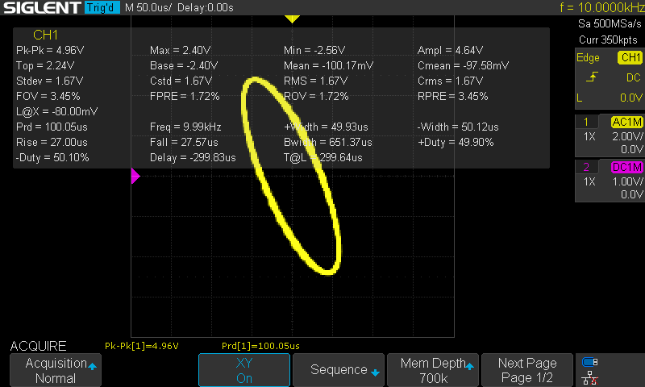
>
> Fig 4.1.9.Masurarea defazajului semnalelor IN-OUT
>
> Se observa din aceasta masuratoare privind tabela urmatoare ca defazajul este de aproximativ 45 de grade.
>
> 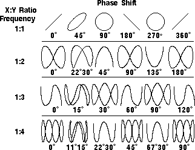
>
> Fig 4.1.10.Phase Shift diagram(sursa <http://vega.unitbv.ro/~zaharia/scope/meastech.html)>

## Raspunsul sistemului in domeniul timp

> Pentru fiecare efect s-a facut cate o masuratoare la osciloscop pentru a valida efectele: Pentru distortion am obtinut urmatorul semnal de iesire:
>
> 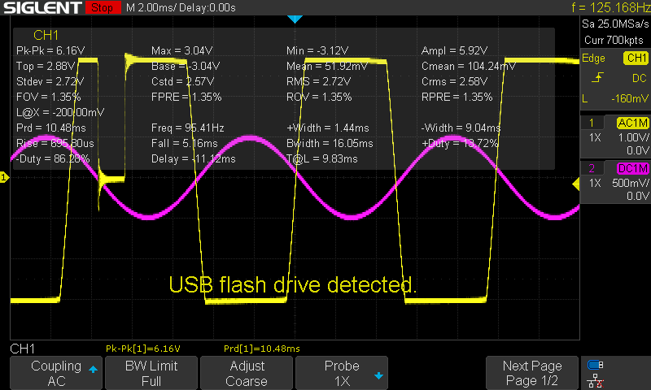
>
> Fig 4.2.1.Efect de distortion aplicat semnalului de intrare de la ADC(Galben-DAC)
>
> Problema principala este defazajul semnalului ceea ce afecteaza calitatea audio.Un layout mai bun al circuitului si respectare de reguli impotriva EMI reduc acest defazaj.
>
> Pentru a verifica modul in care se schimba semnalele pentru reverb si delay avem nevoie de interactiune umana cu aplicatia flutter sa vedem modul in care se schimba defazajul semnalului.
>
> Un video demonstrativ al masurarii se ragaseste la urmatorul link: [<u>https://mega.nz/file/YmMQSKZS#mQZLZre_HyP0I91RTGJcKR09QgStrsz3gT6G3BtMVlw\\</u>](https://mega.nz/file/YmMQSKZS%23mQZLZre_HyP0I91RTGJcKR09QgStrsz3gT6G3BtMVlw/)

3.  **Raspunsul in frecventa a sistemului si a filtrelor hardware** Filtrul de pe modulul ADC PCM1808 si DAC PCM5102 este un filtru Low Pass cu urmatoarea caracteristica:

> 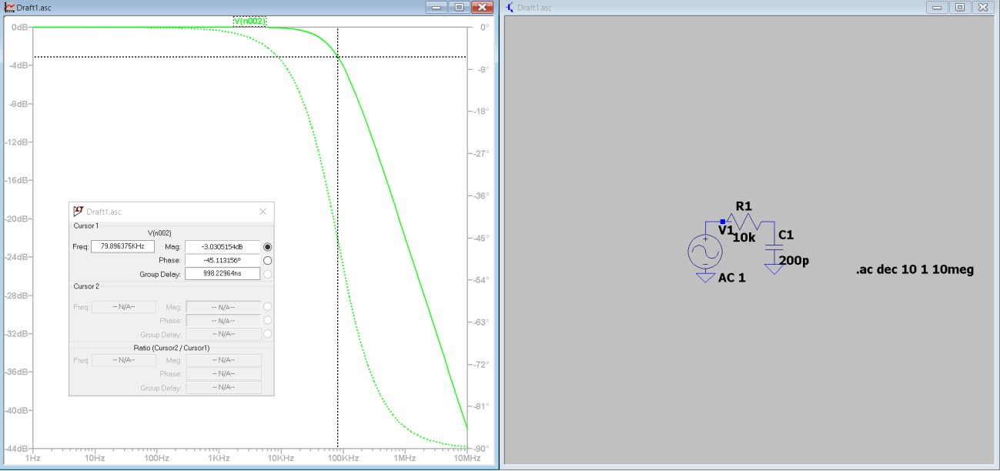
>
> Fig 4.3.1.Simulare caracteristica filtru LP de pe ADC PCM1808A

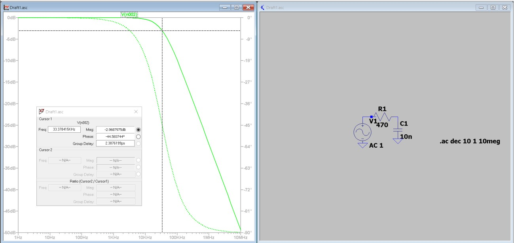

# Bibliografie

> Fig 4.3.2.Simulare caracteristica filtru LP de pe DAC PCM5102

1.  [<u>http://vega.unitbv.ro/~zaharia/scope/meastech.html</u>](http://vega.unitbv.ro/~zaharia/scope/meastech.html) - Phase shift diagram

2.  [<u>https://www.pjrc.com/pcm1802-breakout-board-needs-hack/</u>](https://www.pjrc.com/pcm1802-breakout-board-needs-hack/) - PCM1802 tutorial blog post

3.  [<u>https://arduino.stackexchange.com/questions/96102/no-output-from-pcm5102-i2s-dac</u>](https://arduino.stackexchange.com/questions/96102/no-output-from-pcm5102-i2s-dac) - PCM5102 no output

4.  [<u>https://www.ti.com/lit/ml/sprp499/sprp499.pdf</u>](https://www.ti.com/lit/ml/sprp499/sprp499.pdf) - TI Pedal Board presentation

5.  [<u>https://it.mathworks.com/help/dsp/ug/code-generation-with-blocks.html</u>](https://it.mathworks.com/help/dsp/ug/code-generation-with-blocks.html) DSP ToolBox System

6.  [<u>https://www.mathworks.com/help/ecoder/stmicroelectronicsstm32f4discovery/ug/parametric-audio-</u> <u>equalizer-for-stm32-discovery-boards.html</u>](https://www.mathworks.com/help/ecoder/stmicroelectronicsstm32f4discovery/ug/parametric-audio-equalizer-for-stm32-discovery-boards.html) - Embedded Coder Parametric equalizer

7.  [<u>https://www.ti.com/product/PCM5102</u>](https://www.ti.com/product/PCM5102) - PCM5102 DAC datasheet

8.  [<u>https://www.ti.com/lit/gpn/PCM1808-Q1</u>](https://www.ti.com/lit/gpn/PCM1808-Q1) - PCM1808 ADC datasheet

9.  [<u>https://medium.com/@davidramsay/how-to-get-i2s-working-on-an-stm32-mcu-33de0e9c9ff8</u>](https://medium.com/%40davidramsay/how-to-get-i2s-working-on-an-stm32-mcu-33de0e9c9ff8) - How to get I2S working on CubeMX

10. [<u>Developing Digital Audio Effects in Real Time for Acoustic Guitar using Simulink Model -</u> <u>developing-digital-audio-effects-in-real-time-for-acoustic-guitar-using-simulink-model-</u> <u>IJERTCONV8IS13002.pdf</u>](https://www.ijert.org/research/developing-digital-audio-effects-in-real-time-for-acoustic-guitar-using-simulink-model-IJERTCONV8IS13002.pdf) – Developing Digital Audio Effects ...

11. [<u>https://github.com/sebastiang2004/Nucleo-G431-PCM-Audio-Pedal</u>](https://github.com/sebastiang2004/Nucleo-G431-PCM-Audio-Pedal) - Repository principal proiect Flutter+Firmware STM32G431

12. [<u>https://mega.nz/file/YmMQSKZS#mQZLZre_HyP0I91RTGJcKR09QgStrsz3gT6G3BtMVlw</u>](https://mega.nz/file/YmMQSKZS#mQZLZre_HyP0I91RTGJcKR09QgStrsz3gT6G3BtMVlw) Masurare defazaj pentru validare efect– delay si reverb

# Anexe
